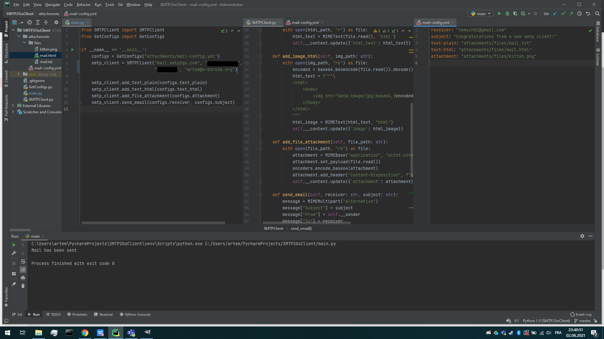

# SMTP Client
Задание 5
Курс Протоколы Интернета

Реализован SMTP клиент, позволяющий отправить plain/html текст, и вложения.

То, что отправляем прописываем в конфиге ```mail-config.yml```

В качестве сервера использовал сервис SMTP2GO.



